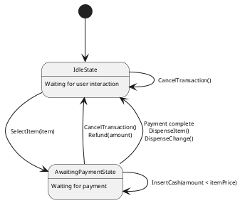
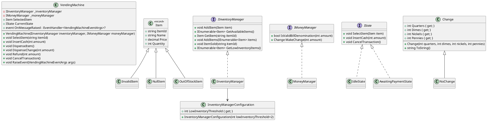
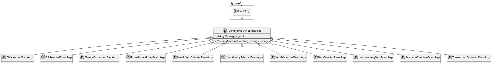
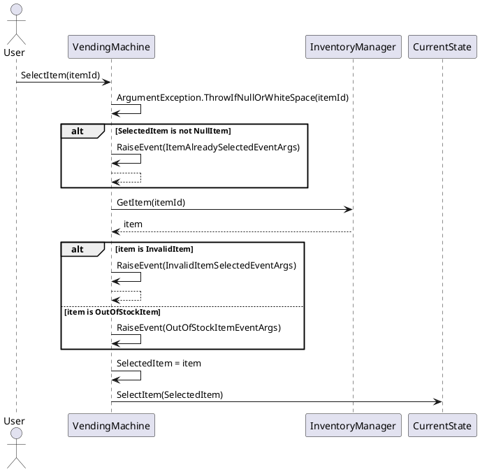
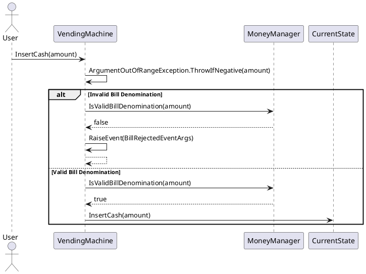
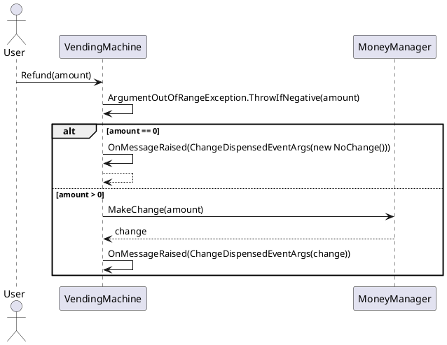
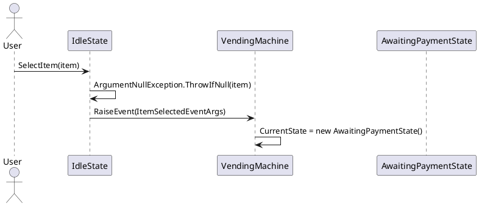
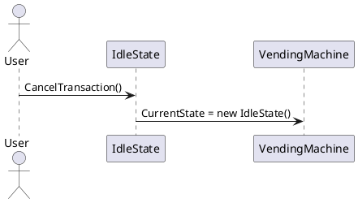
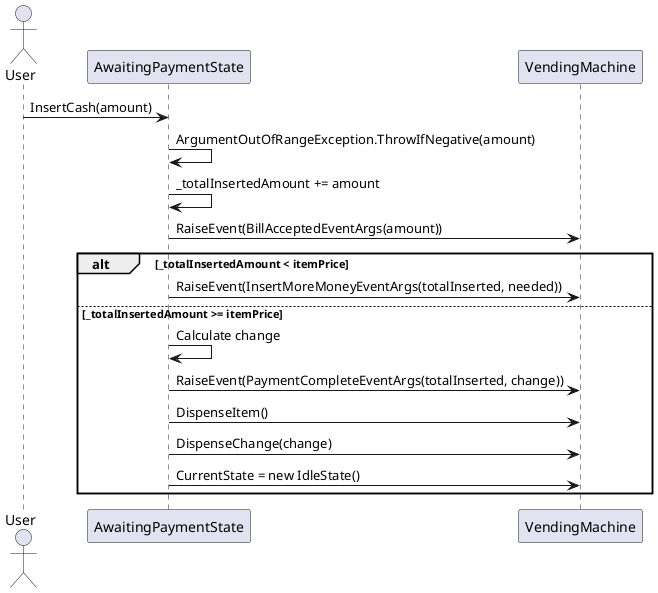
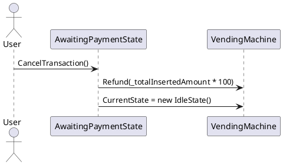

# system-design-vending-machine

## PlantUML Diagrams

[Online Editor](https://www.planttext.com/)
[State Machine Diagrams](https://www.baeldung.com/cs/uml-state-diagrams)

## State Diagram

## Class Diagram

## Events

## Activity Diagrams for Vending Machine

### SelectItem

### Insert Cash

## Refund

## Sequence Diagrams for IState Implementations

### IdleState

#### SelectItem

#### CancelTransaction

### AwaitingPaymentState

#### InsertCash

#### CancelTransaction

