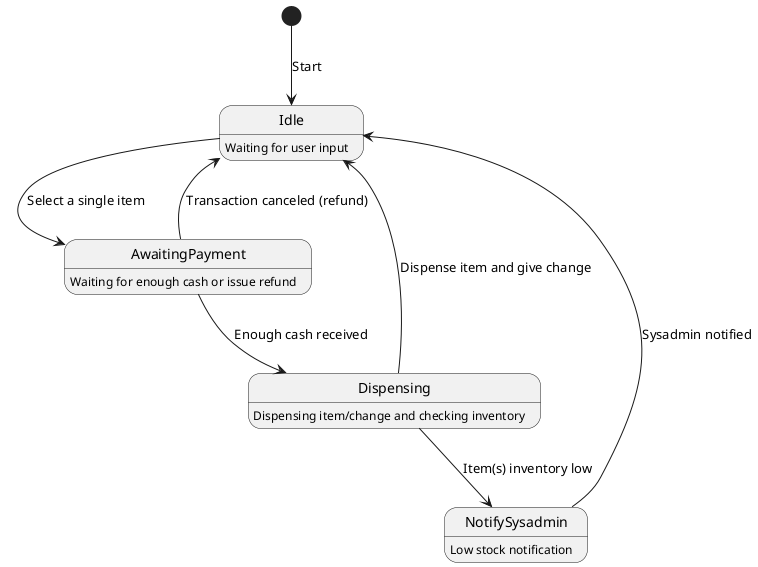
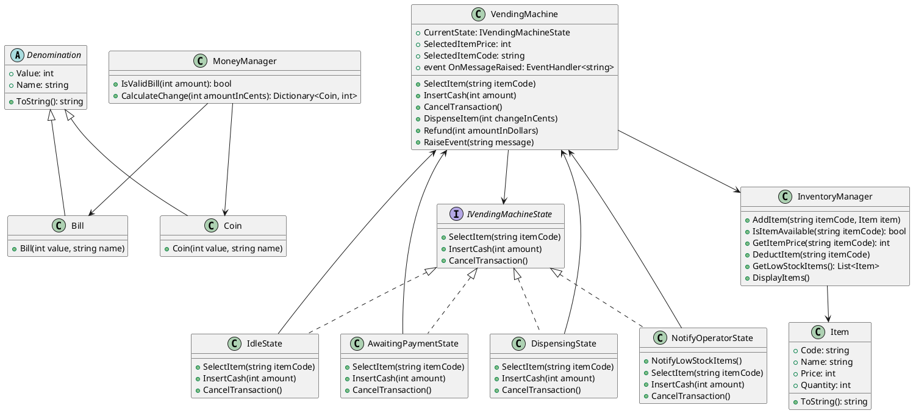

# system-design-vending-machine

## PlantUML Diagrams

### State Diagram

```plantuml
@startuml

[*] --> Idle : Start

Idle --> AwaitingPayment : Select a single item
AwaitingPayment --> Dispensing : Enough cash received
AwaitingPayment --> Idle : Transaction canceled (refund)
Dispensing --> Idle : Dispense item and give change
Dispensing --> NotifySysadmin : Item(s) inventory low
NotifySysadmin --> Idle : Sysadmin notified

Idle : Waiting for user input
AwaitingPayment : Waiting for enough cash or issue refund
Dispensing : Dispensing item/change and checking inventory
NotifySysadmin : Low stock notification

@enduml
```

### Class Diagram

```plantuml
@startuml

' Base class for denominations (Bills and Coins)
abstract class Denomination {
    + Value: int
    + Name: string
    + ToString(): string
}

class Bill extends Denomination {
    + Bill(int value, string name)
}

class Coin extends Denomination {
    + Coin(int value, string name)
}

class MoneyManager {
    + IsValidBill(int amount): bool
    + CalculateChange(int amountInCents): Dictionary<Coin, int>
}

class VendingMachine {
    + CurrentState: IVendingMachineState
    + SelectedItemPrice: int
    + SelectedItemCode: string
    + SelectItem(string itemCode)
    + InsertCash(int amount)
    + CancelTransaction()
    + DispenseItem(int changeInCents)
    + Refund(int amountInDollars)
    + RaiseEvent(string message)
    + event OnMessageRaised: EventHandler<string>
}

interface IVendingMachineState {
    + SelectItem(string itemCode)
    + InsertCash(int amount)
    + CancelTransaction()
}

class IdleState implements IVendingMachineState {
    + SelectItem(string itemCode)
    + InsertCash(int amount)
    + CancelTransaction()
}

class AwaitingPaymentState implements IVendingMachineState {
    + SelectItem(string itemCode)
    + InsertCash(int amount)
    + CancelTransaction()
}

class DispensingState implements IVendingMachineState {
    + SelectItem(string itemCode)
    + InsertCash(int amount)
    + CancelTransaction()
}

class NotifyOperatorState implements IVendingMachineState {
    + NotifyLowStockItems()
    + SelectItem(string itemCode)
    + InsertCash(int amount)
    + CancelTransaction()
}

class InventoryManager {
    + AddItem(string itemCode, Item item)
    + IsItemAvailable(string itemCode): bool
    + GetItemPrice(string itemCode): int
    + DeductItem(string itemCode)
    + GetLowStockItems(): List<Item>
    + DisplayItems()
}

class Item {
    + Code: string
    + Name: string
    + Price: int
    + Quantity: int
    + ToString(): string
}

MoneyManager --> Bill
MoneyManager --> Coin
VendingMachine --> IVendingMachineState
IdleState --> VendingMachine
AwaitingPaymentState --> VendingMachine
DispensingState --> VendingMachine
NotifyOperatorState --> VendingMachine
InventoryManager --> Item
VendingMachine --> InventoryManager

@enduml

```
