# Vending Machine System Design Project

## PlantUML Diagrams

[Online Editor](https://www.planttext.com/)

[State Machine Diagrams](https://www.baeldung.com/cs/uml-state-diagrams)

## System Architecture Diagram

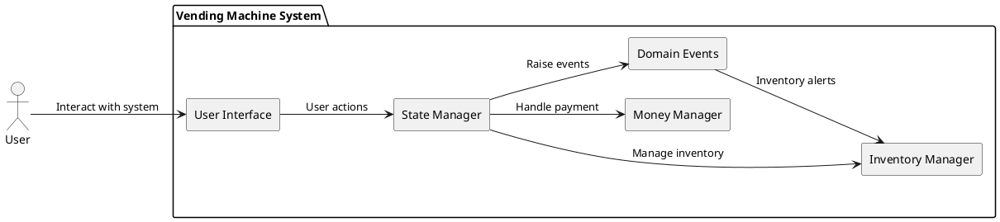

## State Diagram

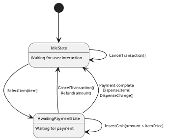

## Class Diagram

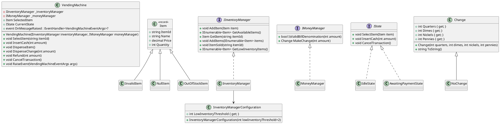

## Events

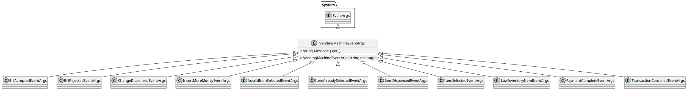

## Activity Diagrams for Vending Machine

### SelectItem

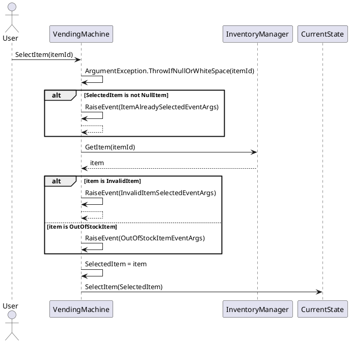

### Insert Cash

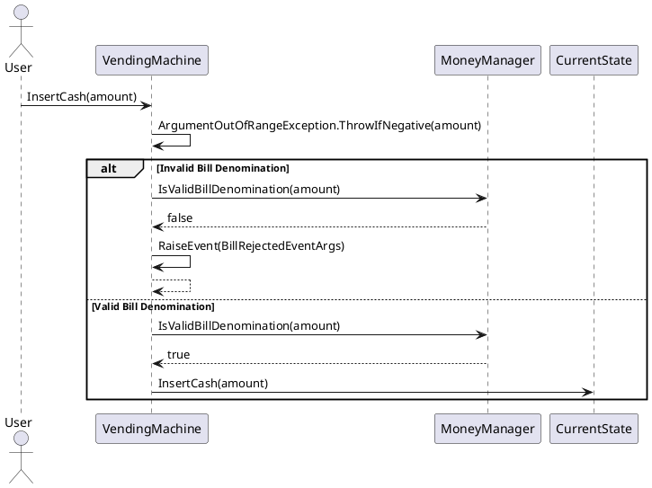

## Refund

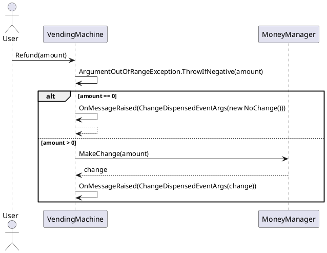

## Sequence Diagrams for IState Implementations

### IdleState

#### SelectItem

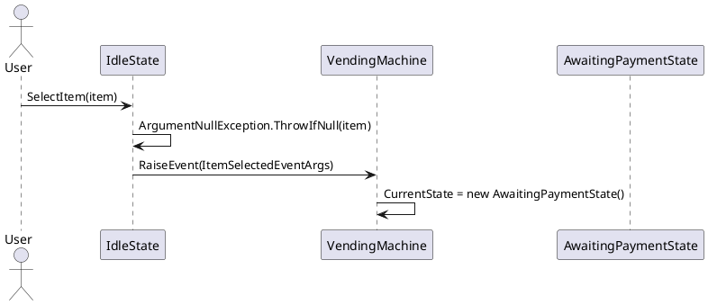

#### CancelTransaction

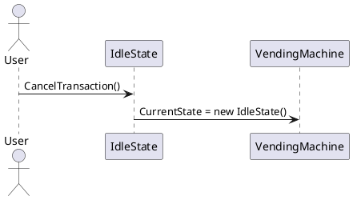

### AwaitingPaymentState

#### InsertCash

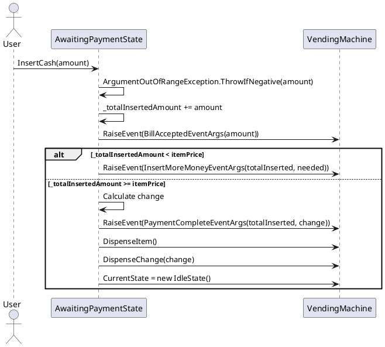

#### CancelTransaction

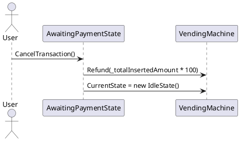

# HLD

# High-Level Design Document: Vending Machine System

## 1. **Overview**

The vending machine system is designed to allow users to purchase items by selecting a product, inserting cash, and receiving the selected item along with any required change. The system implements a modular and event-driven architecture that ensures maintainability, scalability, and ease of testing.

## 2. **Objectives**

-   Enable seamless user interaction for purchasing items.
-   Maintain accurate inventory management.
-   Ensure proper handling of cash transactions, including refunds and dispensing change.
-   Provide clear feedback and error handling for user operations.

## 3. **System Architecture**

### 3.1 Components:

#### 3.1.1 Vending Machine Core:

-   **Responsibilities:** Manages overall operations, current state, selected item, and event-driven messages.
-   **Key Methods:**
    -   `SelectItem(string itemId)`
    -   `InsertCash(int amount)`
    -   `DispenseItem()`
    -   `DispenseChange(int amount)`
    -   `Refund(int amount)`
    -   `CancelTransaction()`

#### 3.1.2 Inventory Management:

-   **Responsibilities:** Tracks and updates item availability in the vending machine.
-   **Interface:** `IInventoryManager`
-   **Core Methods:**
    -   `AddItem(Item item)`
    -   `GetAvailableItems()`
    -   `GetItem(string itemId)`
    -   `ItemSold(string itemId)`

#### 3.1.3 Money Management:

-   **Responsibilities:** Validates cash denominations, calculates and dispenses change.
-   **Interface:** `IMoneyManager`
-   **Core Methods:**
    -   `IsValidBillDenomination(int amount)`
    -   `MakeChange(int amount)`

#### 3.1.4 State Management:

-   Implements the **State Design Pattern**, defining behaviors for different states.
-   **States:**
    -   `IdleState`: The default state, awaiting user interaction.
    -   `AwaitingPaymentState`: Active when an item is selected and awaiting payment.

### 3.2 Event-Driven Design:

Events provide feedback and status updates during operations. Key event types include:

-   `ItemSelectedEventArgs`
-   `InvalidItemSelectedEventArgs`
-   `PaymentCompleteEventArgs`
-   `TransactionCancelledEventArgs`

## 4. **UML Diagrams**

### 4.1 Class Diagram

The Class Diagram defines the system's structure, including core classes like `VendingMachine`, `Item`, `InventoryManager`, and `MoneyManager`. Specialized classes handle exceptions such as `InvalidItem`, `OutOfStockItem`, and `NullItem`.

### 4.2 State Diagram

The State Diagram models the transitions between `IdleState` and `AwaitingPaymentState`, triggered by user actions like selecting an item, inserting cash, or canceling a transaction.

### 4.3 Sequence Diagrams

Sequence Diagrams provide a detailed view of interactions for specific operations, including:

-   Selecting an item (`SelectItem` operation).
-   Inserting cash (`InsertCash` operation).
-   Refunding money (`Refund` operation).

## 5. **Core Features**

### 5.1 Item Selection

-   Users select an item by providing its ID.
-   Invalid or out-of-stock items trigger appropriate error events.
-   Once an item is selected, the system transitions to the `AwaitingPaymentState`.

### 5.2 Payment Handling

-   Users insert cash in valid denominations.
-   Total cash inserted is tracked.
-   If payment is sufficient, the system transitions to dispense the item and change.

### 5.3 Refund Mechanism

-   Users can cancel transactions at any time.
-   Refunds are calculated and dispensed based on the amount inserted.

### 5.4 Inventory Management

-   Tracks available items and quantities.
-   Alerts for low inventory.
-   Updates inventory when items are sold.

## 6. **Error Handling**

-   Invalid actions (e.g., selecting an invalid item, inserting invalid denominations) trigger descriptive error events.
-   Exceptions like `ArgumentException` and `ArgumentOutOfRangeException` ensure robustness.

## 7. **Advanced Features (Future Enhancements)**

-   Support for digital payments.
-   Restocking notifications for operators.
-   Enhanced diagnostics for maintenance.
-   Multi-user handling for high-demand scenarios.

## 8. **Testing Strategy**

-   Unit tests for individual components (e.g., `InventoryManager`, `MoneyManager`).
-   Integration tests for state transitions and event handling.
-   Edge case tests for invalid inputs and concurrent operations.

## 9. **Conclusion**

This vending machine system design leverages modular architecture, event-driven communication, and robust state management to ensure seamless operation and extensibility. It provides a solid foundation for building a reliable and user-friendly vending experience.

---

# LLD

# Low-Level Design Document: Vending Machine System

## 1. Overview

This document provides the low-level design for the Vending Machine System, detailing implementation specifics, class attributes, methods, interactions, and exception handling to enable the development of a robust and maintainable system.

---

## 2. Class Specifications

### 2.1. VendingMachine

#### **Attributes**

-   `IInventoryManager _inventoryManager`: Manages inventory operations.
-   `IMoneyManager _moneyManager`: Handles payment validation and change computation.
-   `Item SelectedItem`: Stores the currently selected item.
-   `IState CurrentState`: Tracks the current state of the vending machine.
-   `event OnMessageRaised`: Event triggered for various operations.

#### **Methods**

-   `SelectItem(string itemId)`:
    -   **Input**: `itemId` (ID of the item to select)
    -   **Logic**:
        -   Validate `itemId`.
        -   Check if `SelectedItem` is already set. If yes, raise `ItemAlreadySelectedEventArgs`.
        -   Retrieve the item from `_inventoryManager`.
        -   Handle `InvalidItem` or `OutOfStockItem`.
        -   Set `SelectedItem` and delegate to `CurrentState.SelectItem`.
-   `InsertCash(int amount)`:
    -   **Input**: `amount` (Cash inserted)
    -   **Logic**:
        -   Validate denomination using `_moneyManager`.
        -   Delegate to `CurrentState.InsertCash`.
-   `DispenseItem()`:
    -   **Logic**: Dispense the selected item and update inventory via `_inventoryManager`.
-   `DispenseChange(int amount)`:
    -   **Logic**: Use `_moneyManager` to compute change and notify the user via `ChangeDispensedEventArgs`.
-   `Refund(int amount)`:
    -   **Logic**:
        -   If `amount == 0`, notify using `NoChange`.
        -   Otherwise, compute change and notify using `ChangeDispensedEventArgs`.
-   `CancelTransaction()`:
    -   **Logic**:
        -   Refund any collected amount.
        -   Transition to `IdleState`.

---

### 2.2. Item

#### **Attributes**

-   `string ItemId`: Unique identifier for the item.
-   `string Name`: Item name.
-   `decimal Price`: Item price.
-   `int Quantity`: Number of units available.

#### **Derived Classes**

-   `InvalidItem`, `OutOfStockItem`: Special item states for error handling.

---

### 2.3. InventoryManager (Implements `IInventoryManager`)

#### **Attributes**

-   `Dictionary<string, Item> _items`: Maps item IDs to their corresponding `Item` objects.
-   `InventoryManagerConfiguration _config`: Configuration for low inventory thresholds.

#### **Methods**

-   `AddItem(Item item)`:
    -   Adds a single item to the inventory.
-   `GetAvailableItems()`:
    -   Returns a list of items with `Quantity > 0`.
-   `GetItem(string itemId)`:
    -   Retrieves the `Item` based on `itemId`. Returns `InvalidItem` or `OutOfStockItem` if applicable.
-   `ItemSold(string itemId)`:
    -   Decreases the quantity of the specified item.
-   `GetLowInventoryItems()`:
    -   Returns items with `Quantity < _config.LowInventoryThreshold`.

---

### 2.4. MoneyManager (Implements `IMoneyManager`)

#### **Attributes**

-   `HashSet<int> _validDenominations`: Contains valid cash denominations (e.g., `[1, 5, 10, 20]`).
-   `Dictionary<int, int> _changeInventory`: Tracks available coins for change computation.

#### **Methods**

-   `IsValidBillDenomination(int amount)`:
    -   Validates the cash denomination.
-   `MakeChange(int amount)`:
    -   Computes and dispenses change using `_changeInventory`.

---

### 2.5. States (Implement `IState`)

#### **IdleState**

-   **Methods**:
    -   `SelectItem(Item item)`:
        -   Validates the item and transitions to `AwaitingPaymentState`.
    -   `CancelTransaction()`:
        -   Resets the machine state.

#### **AwaitingPaymentState**

-   **Attributes**:

    -   `int _totalInsertedAmount`: Tracks the total payment received.

-   **Methods**:
    -   `InsertCash(int amount)`:
        -   Updates `_totalInsertedAmount`.
        -   Triggers `InsertMoreMoneyEventArgs` if more payment is required.
        -   If sufficient, computes change, dispenses the item, and transitions to `IdleState`.
    -   `CancelTransaction()`:
        -   Refunds the collected amount and transitions to `IdleState`.

---

### 2.6. Events

-   **Base Class**: `VendingMachineEventArgs`
-   **Derived Events**:
    -   `BillAcceptedEventArgs`
    -   `BillRejectedEventArgs`
    -   `ItemSelectedEventArgs`
    -   `OutOfStockItemEventArgs`
    -   `PaymentCompleteEventArgs`
    -   `TransactionCancelledEventArgs`

---

## 3. Key Interactions

### 3.1. Item Selection

1. User selects an item (`VendingMachine.SelectItem`).
2. `InventoryManager.GetItem` validates the item.
3. If valid, `IdleState.SelectItem` transitions to `AwaitingPaymentState`.

### 3.2. Payment Handling

1. User inserts cash (`VendingMachine.InsertCash`).
2. `MoneyManager.IsValidBillDenomination` verifies the denomination.
3. If valid, `AwaitingPaymentState.InsertCash` updates `_totalInsertedAmount` and raises appropriate events.

### 3.3. Dispense Item and Change

1. After sufficient payment:
    - `AwaitingPaymentState.InsertCash` calculates change.
    - Calls `VendingMachine.DispenseItem` and `VendingMachine.DispenseChange`.
2. Transitions to `IdleState`.

---

## 4. Error Handling

-   **Invalid Item Selection**: Raise `InvalidItemSelectedEventArgs`.
-   **Out of Stock**: Raise `OutOfStockItemEventArgs`.
-   **Invalid Cash Denomination**: Raise `BillRejectedEventArgs`.
-   **Hardware Failure**:
    -   Add logging and fallback mechanisms (e.g., retry operations).

---

## 5. Testing Plan

1. **Unit Tests**:

    - Test individual methods, such as `SelectItem`, `InsertCash`, and `MakeChange`.
    - Validate state transitions (e.g., `IdleState` to `AwaitingPaymentState`).

2. **Integration Tests**:

    - Simulate end-to-end scenarios (e.g., item selection, payment, and dispensing).

3. **Edge Cases**:
    - Invalid item selection, insufficient payment, or cancelled transactions.

---

## 6. Conclusion

This low-level design provides a granular blueprint for implementing the Vending Machine system. Each component is modular and testable, ensuring the system is extensible, robust, and easy to maintain. Further extensions can include digital payment integration or advanced inventory management systems.
